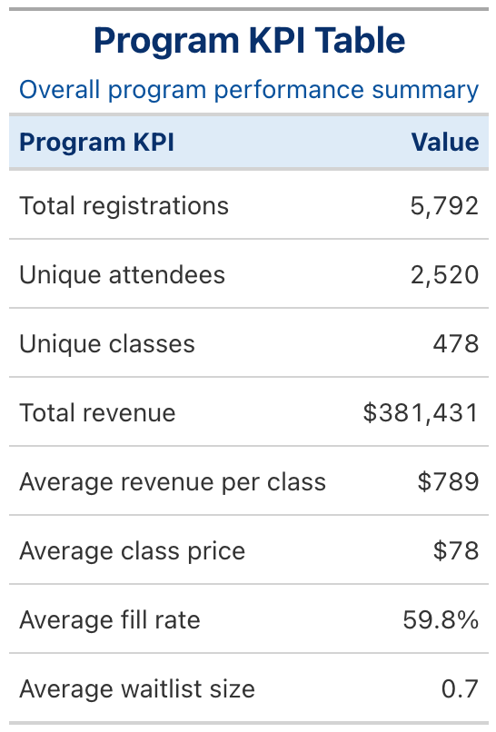
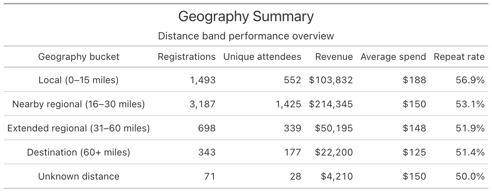
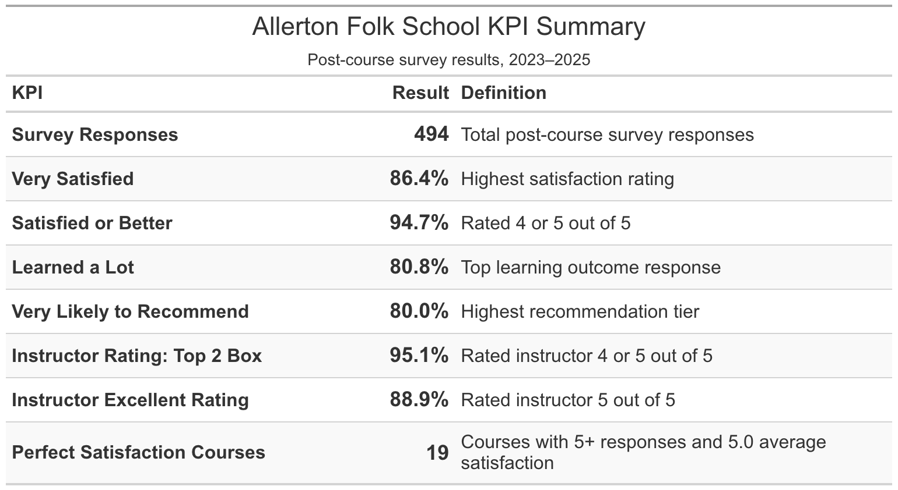

# Allerton Folk School Event Registration Analysis

An overview of our findings from the Allerton Folk School event registration study using the KPI tables.

## Program KPI Table

Overall program performance summary.

## Retention KPI Table

First-time and repeat attendee summary.

## Price-Band Summary Table

Demand and economics by class price band.

## Geography Summary

Distance band performance overview.

## Post-Course Survey KPI Summary

Post-course survey results from 2023–2025.

