```{r setup, include=FALSE}
knitr::opts_chunk$set(
  echo = FALSE,
  warning = FALSE,
  message = FALSE,
  fig.align = "center",
  out.width = "75%"
)
```

# Introduction

## Client and project context

This project is conducted for Bridget Rose Frerichs, Associate Director of Advancement at Allerton Park & Retreat Center. Allerton Park has expanded its public programming over the last decade and launched The Farms: An Allerton Folk School in 2023. Registration information is currently distributed across multiple operational systems, primarily Eventbrite and CourseStorm, with additional context available from survey data.

The client's overarching need is a holistic, data-informed understanding of who attends Allerton programs and how they register and purchase. The analysis is intended to support future decisions about programming, outreach, pricing, and audience development.

## Problem statement

The project goal is to create an integrated, analysis-ready view of Allerton Park event and course registrations and use it to produce clear, client-ready insights about:

1.  **Where registrants come from**, including geographic concentration and distance from Allerton.
2.  **Which attendees are repeat participants**, and what characteristics distinguish them.
3.  **Which attendees buy at which price points**, including how pricing relates to demand, sellout behavior, and revenue.

A particular emphasis of the project is placed on Folk School participants, though the current report summarizes the broader program-level patterns available at the midterm stage.

## Midterm report objectives

This technical midterm report has four purposes:

-   document the current analytical direction and rationale,
-   summarize exploratory findings from the integrated registration dataset,
-   present preliminary statistical analyses tied to the three core client questions, and
-   identify next steps for the remainder of the semester.

At this stage, the analysis should be interpreted as preliminary (mainly focused on the 3 questions) but decision-relevant. The emphasis is on building defensible definitions, testing useful comparisons, and surfacing patterns that will guide the final report.

# Data and methodology

## Data sources

The working dataset combines historical registration data exported from:

-   Eventbrite
-   CourseStorm
-   supplementary survey fields where available

The merged dataset preserves source indicators and includes standardized variables for attendee, class/event, price paid, class date, registration date, geography, and program/subcategory.

## Data preparation summary

The analysis depends on substantial data cleaning and harmonization. Major preparation steps included:

-   standardizing date fields such as registration date and class start date,
-   harmonizing program names, subcategories, and platform-specific labels,
-   constructing attendee-level identifiers for repeat-attendance analysis,
-   cleaning ZIP code and location fields for geography analysis,
-   defining price bands for demand and pricing comparisons, and
-   deriving class-level operational variables such as fill rate, sellout indicator, and waitlist size.

## Key analytic definitions

To keep the report technically consistent, the following working definitions were used:

-   Registration: one seat or enrollment attached to one attendee and one class/event instance.
-   Unique attendee: a person-level record after de-duplication across sources.
-   Repeat attendee: an attendee with more than one registration in the combined dataset.
-   Fill rate: registrants divided by maximum seats for a class instance.
-   Sellout: a class with registrations greater than or equal to max seats.
-   Distance band: attendee grouped by estimated distance from Allerton using ZIP-based geography.
-   Price band: class grouped into one of the following bands: `<25`, `25-49`, `50-74`, `75-99`, `100-149`, `150+`.

## Analytical rationale

The analytical structure follows the client's three core questions.

-   **Location analysis** is used to identify the program's core catchment area and whether different distance bands differ in spending and retention.
-   **Repeat-attendance analysis** is used to measure loyalty, identify high-value segments, and evaluate whether some entry categories generate more future return than others.
-   **Price-point analysis** is used to examine whether demand weakens at higher prices or whether selected categories exhibit pricing power.

Because the report is being produced at midterm, the statistical analysis is primarily descriptive, comparative, and exploratory, with emphasis on effect patterns rather than finalized causal claims.

# Exploratory data analysis

## Overall program performance

The program-level KPIs show that the current dataset contains 5,792 registrations, 2,520 unique attendees, 478 unique classes, and \$381,431 in total revenue. Average fill rate is 59.8%, suggesting that many classes still have room to grow, while average waitlist size remains modest.

The program also appears to be concentrated in a few dominant segments. In particular, Art is the largest subcategory by both registrations and revenue, indicating that it serves as the primary volume engine for the current program portfolio.

Script link: <https://github.com/ash-datapro/allerton-project/blob/main/analysis1/general/program_kpi_table.R>

<!-- %> Insert Figure 1 here: Program KPI Table -->

```{r, echo=FALSE, out.width="50%", fig.align="left"}
knitr::include_graphics("analysis1/general/outputs/program_kpi_table.png")
```


***

Script link: https://github.com/ash-datapro/allerton-project/blob/main/analysis1/general/registrations_distributions.R

<!-- %> Insert Figure 2 here: Registrations Over Time -->

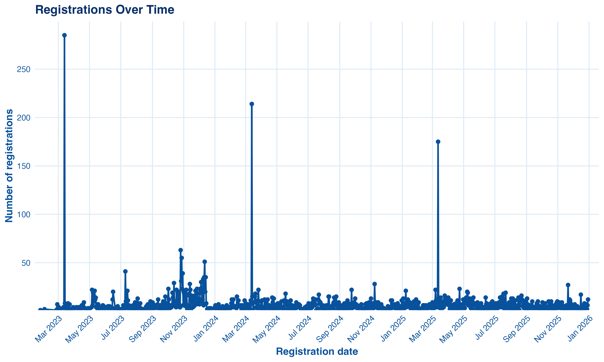

Interpretation. Registration activity is uneven over time, with several pronounced spikes that may correspond to seasonal launches, registration opening dates, or batch processing effects. This pattern suggests that future modeling should account for the timing of class release and calendar seasonality rather than assuming a smooth trend.

***
Script link: https://github.com/ash-datapro/allerton-project/blob/main/analysis1/general/revenue_over_time.R

<!-- %> Insert Figure 3 here: Monthly Revenue Over Time -->

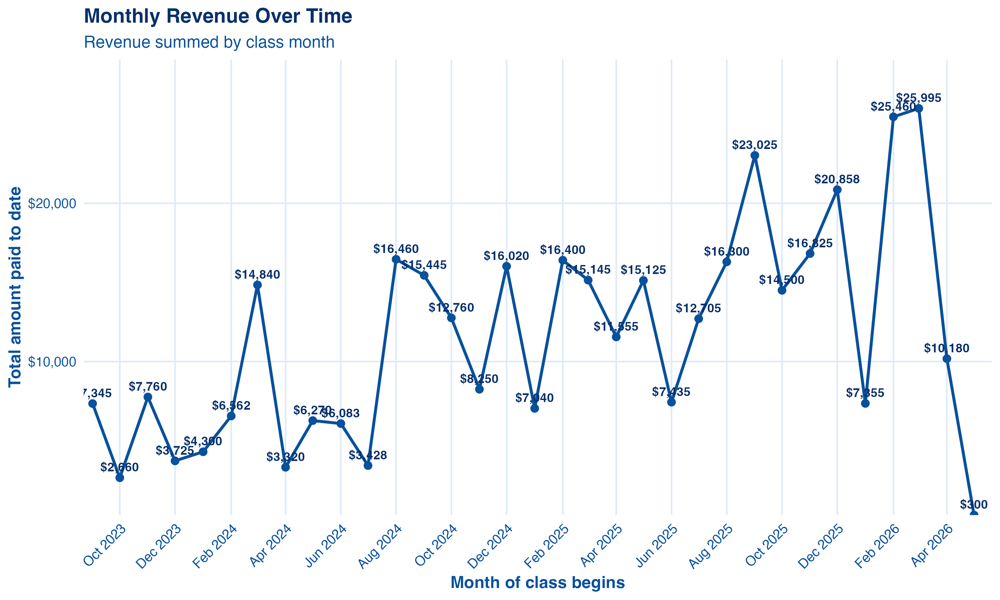

Interpretation. Revenue appears stronger in later periods, especially from late 2024 onward. This increase may reflect a combination of higher class volume, improved pricing, stronger class mix, and maturing demand for Folk School programming.

***
Script link: https://github.com/ash-datapro/allerton-project/blob/main/analysis1/general/class_count_by_month.R

<!-- %> Insert Figure 4 here: Class Count by Month -->

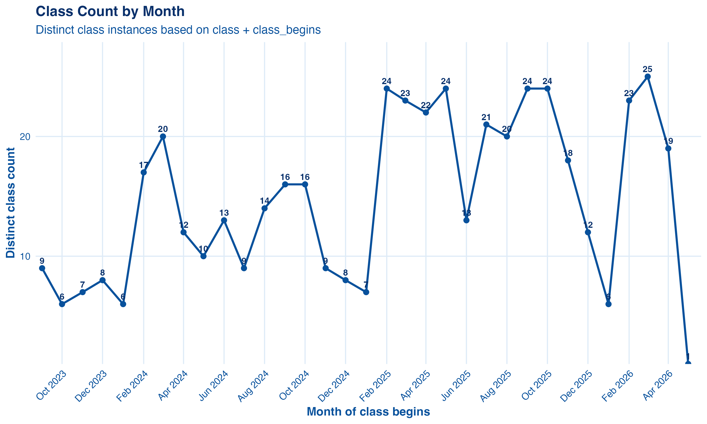

Interpretation. Class volume is not constant across time. This matters because growth in registrations or revenue cannot be interpreted independently of how many classes were offered in a given period.

***
Script link: https://github.com/ash-datapro/allerton-project/blob/main/analysis1/general/registrations_by_subcategory.R

<!-- %> Insert Figure 5 here: Registrations by Subcategory -->

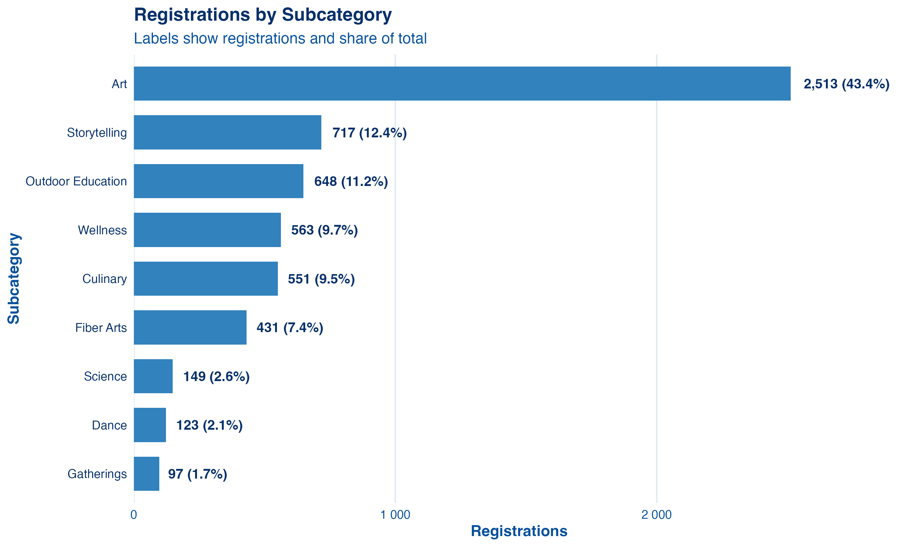

***
Script link: https://github.com/ash-datapro/allerton-project/blob/main/analysis1/general/revenue_by_subcategory.R

<!-- %> Insert Figure 6 here: Revenue by Subcategory -->

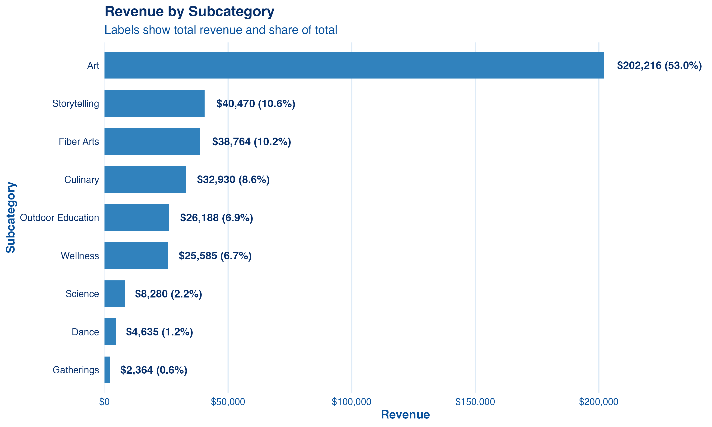

Interpretation. Art accounts for approximately 43.4% of registrations and 53.0% of revenue, indicating that its average revenue contribution is stronger than its share of total registrations. This suggests that category mix is likely to matter in any future pricing or loyalty analysis.

# Statistical analysis and preliminary results

## 1. Location and attendee geography

### Motivation

The first client question asks where attendees come from. Geography matters because it can reveal whether Allerton primarily serves a hyper-local audience, a regional market, or a destination audience. Geography is also useful for targeting marketing, prioritizing partnerships, and interpreting whether travel burden affects repeat behavior or spending.

### Descriptive geography results

The current results show that Allerton's audience is predominantly regional rather than long-distance. The largest attendee group falls in the 16-30 mile band, followed by the 0-15 mile band.

***
Script link: https://github.com/ash-datapro/allerton-project/blob/main/analysis1/location/distance_buckets.R

<!-- %> Insert Figure 7 here: Students by Distance from Allerton -->

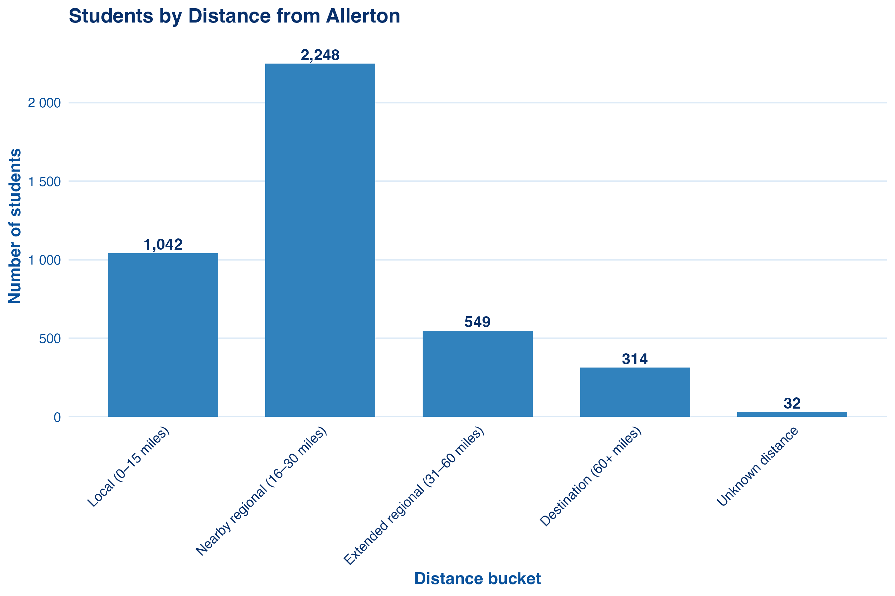

***
Script link: https://github.com/ash-datapro/allerton-project/blob/main/analysis1/location/geography_summary_table.R

<!-- %> Insert Figure 8 here: Geography Summary Table -->

```{r, echo=FALSE, out.width="50%", fig.align="left"}
knitr::include_graphics("analysis1/location/outputs/geography_summary_table.png")
```


Interpretation. The 16-30 mile band is the program's core market by both attendance and revenue. The local and nearby regional bands together account for the majority of attendees, which implies that Allerton currently functions more as a strong regional destination than as a broad statewide or national destination.

### ZIP-level concentration

Script link: https://github.com/ash-datapro/allerton-project/blob/main/analysis1/location/top15_zipcodes.R

<!-- %> Insert Figure 9 here: Top 15 ZIP Codes by Registrations -->

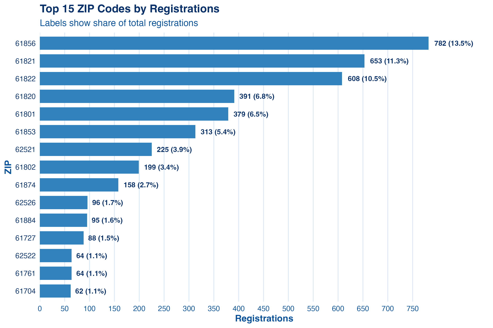

<!-- *** -->
<!-- Script link: https://github.com/ash-datapro/allerton-project/blob/main/analysis1/location/zipcodes_by_revenue.R -->

<!-- <!-- > Insert Figure 10 here: Top 15 ZIP Codes by Revenue --> -->

<!-- 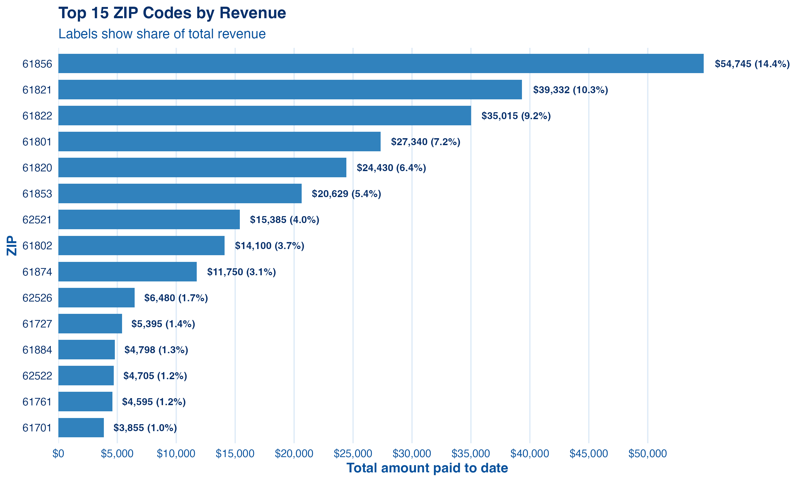 -->

***
Script link: https://github.com/ash-datapro/allerton-project/blob/main/analysis1/location/attendee_origin_zip_map.R

<!-- > Insert Figure 11 here: Attendee Origin by ZIP Map -->

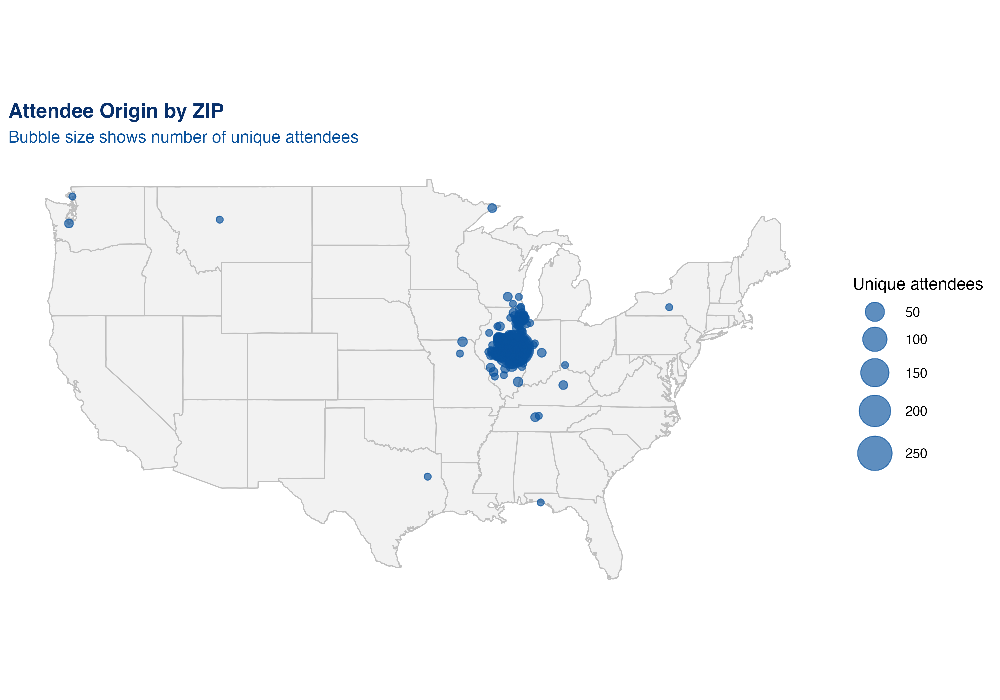

Interpretation. Demand is concentrated in a small set of local-area ZIP codes, with ZIP codes such as 61856, 61821, and 61822 contributing the most registrations and revenue. The map supports a heavy central Illinois cluster with a smaller number of attendees coming from farther away.

### Geography and attendee value

Script link: https://github.com/ash-datapro/allerton-project/blob/main/analysis1/location/zipcodes_by_revenue.R

<!-- > Insert Figure 12 here: Distance Band vs Average Spend -->

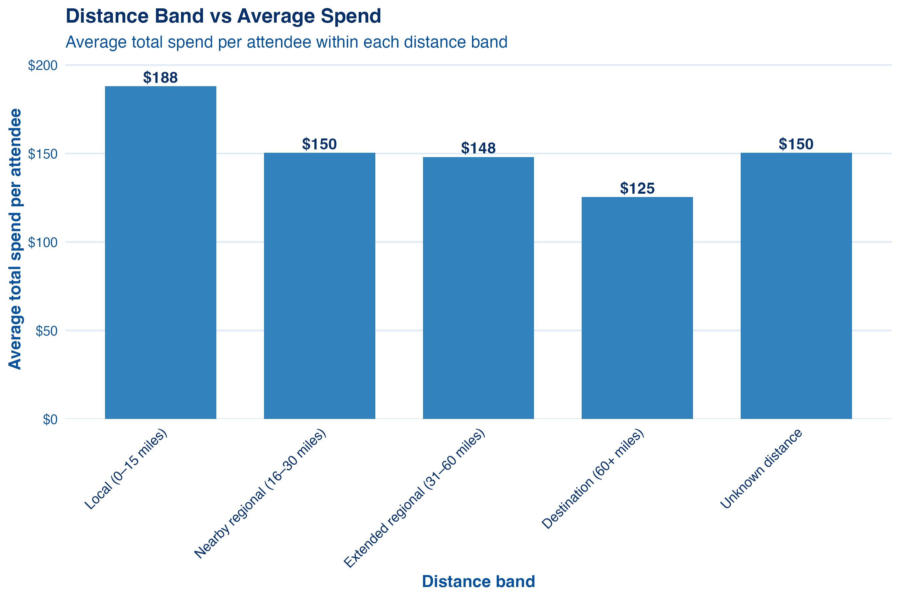

***
Script link: https://github.com/ash-datapro/allerton-project/blob/main/analysis1/location/distance_band_repeat_rate.R

<!-- > Insert Figure 13 here: Distance Band vs Repeat Rate -->

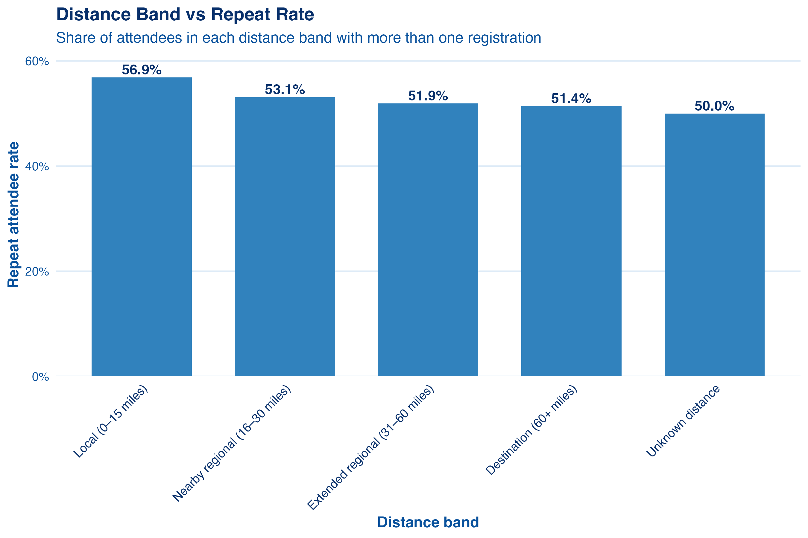

Interpretation. Nearby attendees are not only the largest audience segment, but also the most valuable on a per-attendee basis. The local 0-15 mile band has the highest average spend and the highest repeat rate, while the 60+ mile band has the lowest average spend. This suggests that proximity may support stronger ongoing engagement.

### Preliminary statistical direction

A natural next step is to move from descriptive comparison to formal testing. The final analysis should consider:

-   a chi-square test comparing repeat-attendee share across geography bands,
-   an ANOVA or Kruskal-Wallis test comparing spend across geography bands, and
-   a multivariable regression where repeat status or total spend is modeled as a function of distance band, subcategory mix, and first-attended class characteristics.

At midterm, the evidence supports the practical conclusion that Allerton's strongest market is nearby and regional, and that this nearby audience is disproportionately important for both repeat participation and value.

## 2. Repeat-attendance patterns

### Motivation

The second client question asks which attendees are repeat attendees and what distinguishes them. This is central to program sustainability because repeat attendees often represent lower acquisition cost, higher lifetime value, and greater responsiveness to future programming.

### Overall retention profile

Script link: https://github.com/ash-datapro/allerton-project/blob/main/analysis1/repeat-attendance/retention_kpi.R

<!-- > Insert Figure 14 here: Retention KPI Table -->

```{r, echo=FALSE, out.width="50%", fig.align="left"}
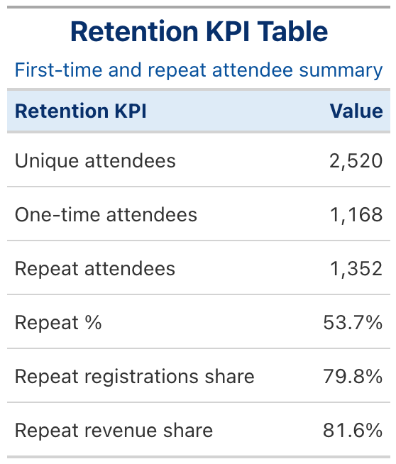
```

***
Script link: https://github.com/ash-datapro/allerton-project/blob/main/analysis1/repeat-attendance/repeat_unique.R

<!-- > Insert Figure 15 here: First-Time vs Repeat Attendees -->

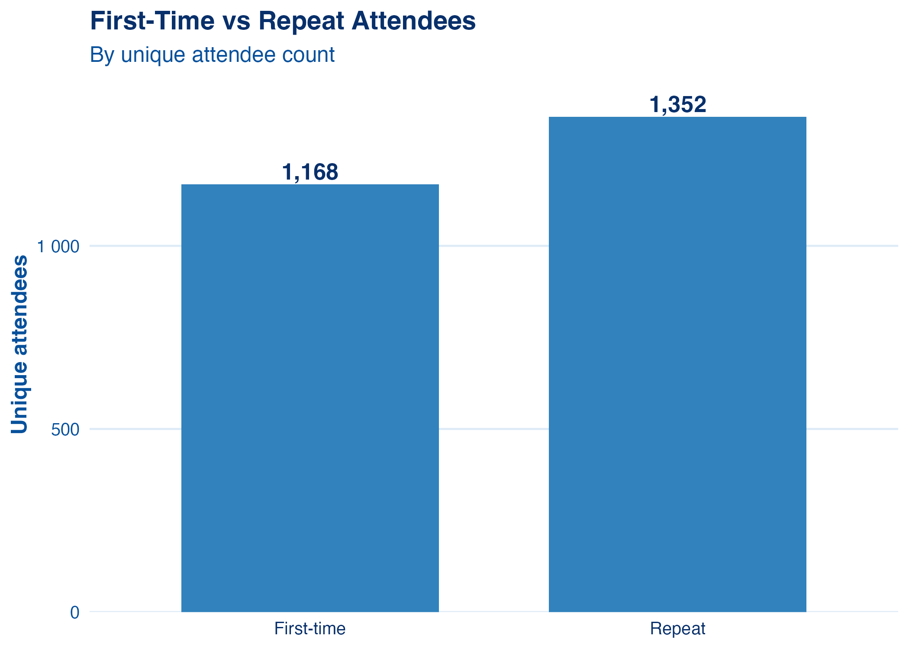

***
Script link: https://github.com/ash-datapro/allerton-project/blob/main/analysis1/repeat-attendance/repeat_distribution.R

<!-- > Insert Figure 16 here: Distribution of Visit Frequency -->

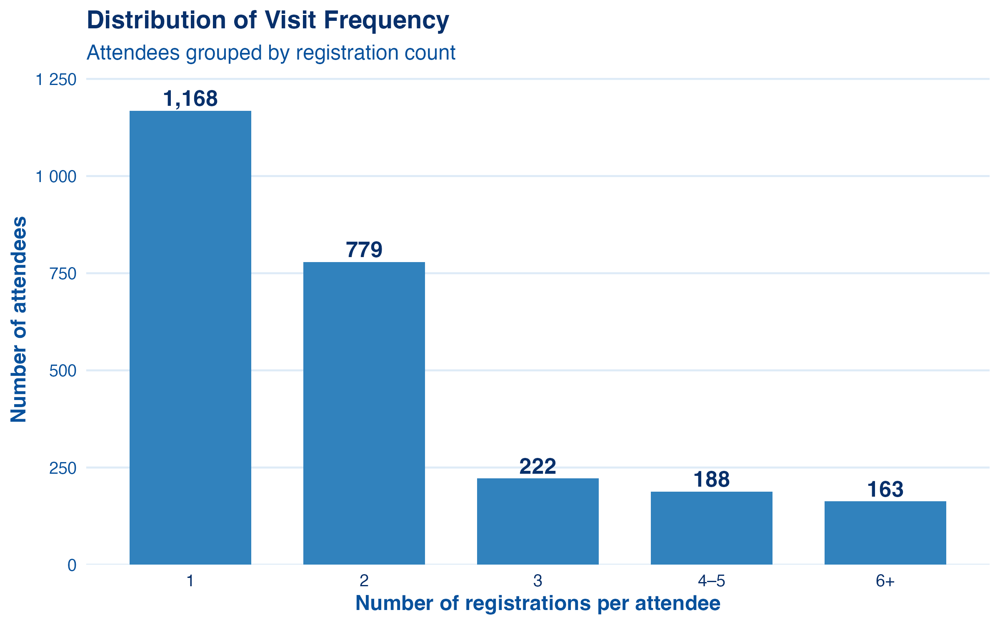

***
Script link: https://github.com/ash-datapro/allerton-project/blob/main/analysis1/repeat-attendance/revenue_by_frequency.R

<!-- > Insert Figure 17 here: Revenue Contribution by Visit Frequency -->

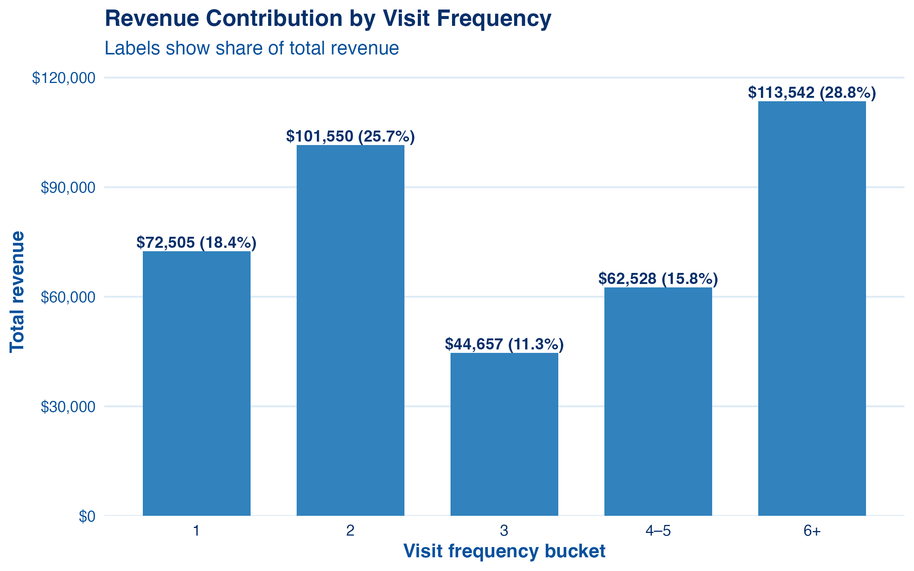

Interpretation. Repeat behavior is economically central to the program. Although 53.7% of attendees are repeat participants, those returners account for 79.8% of registrations and 81.6% of revenue. In particular, the 6+ registration group contributes the single largest share of revenue among visit-frequency bands, indicating the presence of a small but highly valuable loyal core.

### Return timing and cohort behavior

Script link: https://github.com/ash-datapro/allerton-project/blob/main/analysis1/repeat-attendance/days_to_next.R

<!-- > Insert Figure 18 here: Days to Next Registration -->

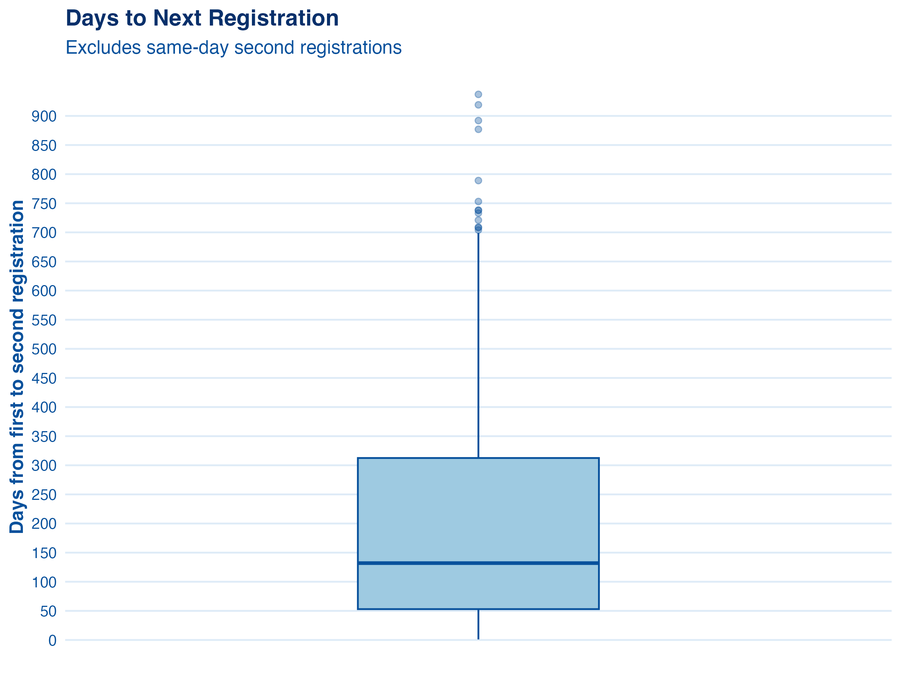

***
Script link: https://github.com/ash-datapro/allerton-project/blob/main/analysis1/repeat-attendance/cohort_retention_monthly.R

<!-- > Insert Figure 19 here: Cohort Retention by First Class Month -->

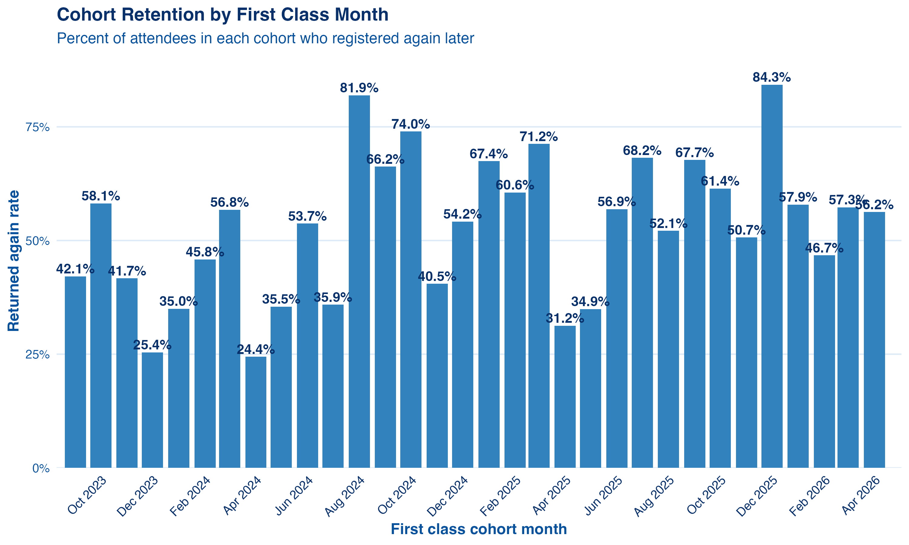

Interpretation. The median gap between first and second registration is approximately 130 days, with a wide spread. This suggests that repeat attendance is often seasonal or calendar-driven rather than immediate. Cohort retention also varies substantially across entry months, indicating that who returns is influenced not only by the attendee, but by when and how they first enter the program.

### Repeat rate by first subcategory

Script link: https://github.com/ash-datapro/allerton-project/blob/main/analysis1/repeat-attendance/repeat_category.R

<!-- > Insert Figure 20 here: Repeat Rate by First Subcategory -->

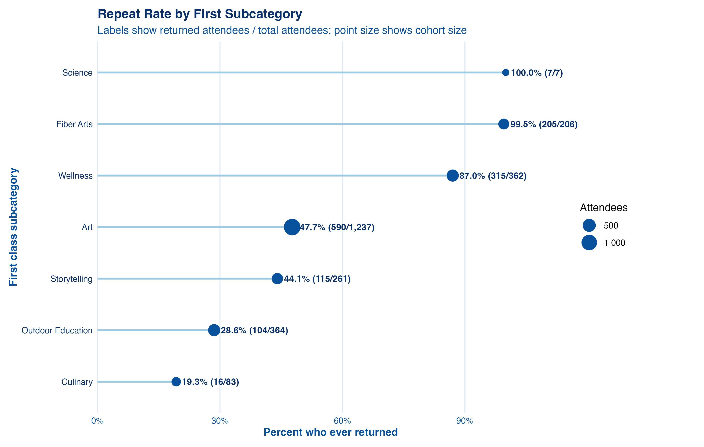

Interpretation. First attended subcategory appears strongly related to future return. Fiber Arts and Wellness appear especially effective at generating return behavior, while Outdoor Education and Culinary appear weaker as first-touch pathways. Art is the largest entry category but shows a more moderate repeat rate.

### Preliminary statistical direction

The final report should move from descriptive retention summaries to formal modeling. Appropriate next analyses include:

-   a logistic regression where repeat-attendee status is predicted using first subcategory, distance band, first price band, and cohort month,
-   a survival or time-to-event analysis for time until second registration,
-   and possibly a negative binomial count model for total number of registrations per attendee.

These methods would allow the team to distinguish whether the observed differences are simply descriptive or remain meaningful after controlling for related factors.

## 3. Price-point behavior

### Motivation

The third client question asks which individuals are buying at which price points. The practical objective is to understand whether higher prices reduce demand, where the volume sweet spot lies, and whether pricing behaves differently across class types.

### Demand by price band

Script link: https://github.com/ash-datapro/allerton-project/blob/main/analysis1/price-points/registrations_by_price_points.R

<!-- > Insert Figure 21 here: Registrations by Price Band -->

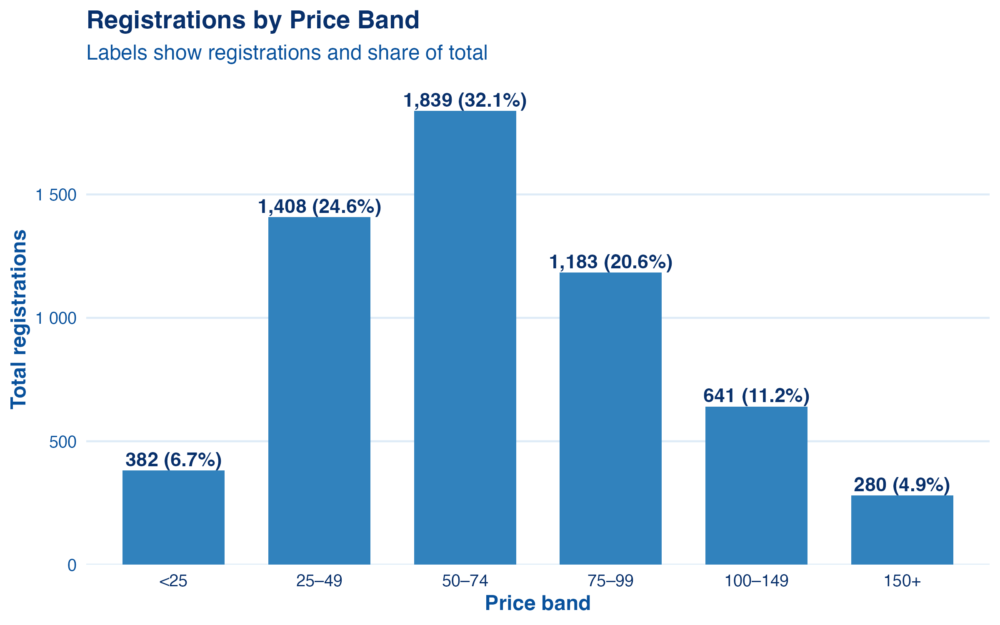

***
Script link: https://github.com/ash-datapro/allerton-project/blob/main/analysis1/price-points/price_band_summary.R

<!-- > Insert Figure 22 here: Price-Band Summary Table -->

```{r, echo=FALSE, out.width="50%", fig.align="left"}
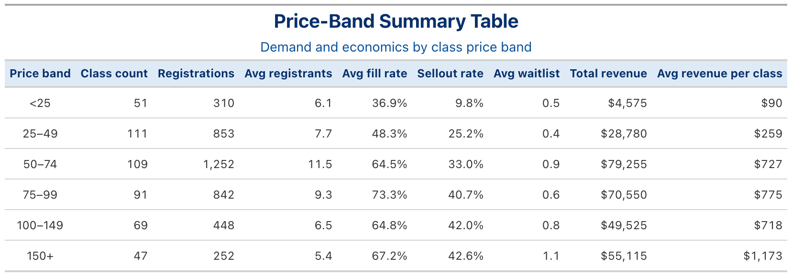
```

Interpretation. The strongest demand is concentrated in the middle of the market, especially the \$50-74 and \$75-99 bands. The \$50-74 band contributes the largest share of registrations, while the \$75-99 band shows the highest average fill rate.

### Fill rate, sellout, and waitlist behavior

Script link: https://github.com/ash-datapro/allerton-project/blob/main/analysis1/price-points/fill_rate_by_price.R

<!-- > Insert Figure 23 here: Fill Rate by Price Band -->

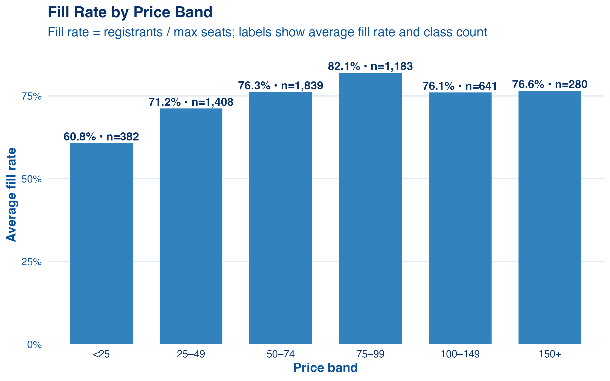

***
Script link: https://github.com/ash-datapro/allerton-project/blob/main/analysis1/price-points/sellout_rate_by_price.R

<!-- > Insert Figure 24 here: Sellout Rate by Price Band -->

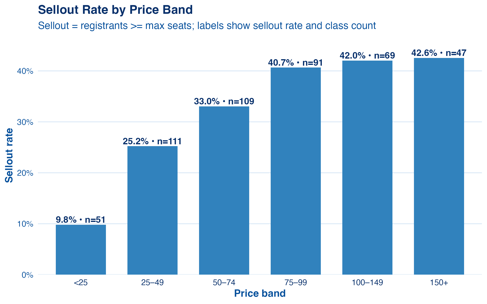

***
Script link: https://github.com/ash-datapro/allerton-project/blob/main/analysis1/price-points/average_waitlist_by_price.R

<!-- > Insert Figure 25 here: Average Waitlist by Price Band -->

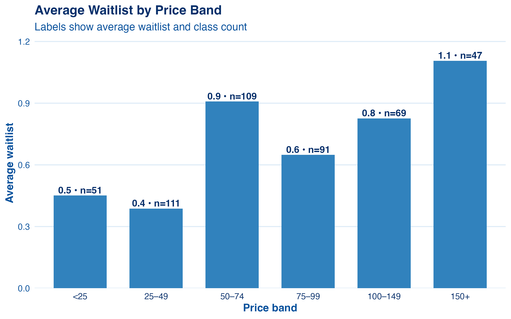

Interpretation. The lowest price bands perform the weakest on fill and sellout, which suggests that lower price does not automatically generate stronger demand. In contrast, higher-price bands maintain relatively strong sellout rates and even larger waitlists, implying that at least some classes retain pricing power.

### Price and revenue relationships

Script link: https://github.com/ash-datapro/allerton-project/blob/main/analysis1/price-points/revenue_per_class.R

<!-- > Insert Figure 26 here: Revenue per Class by Price Band -->

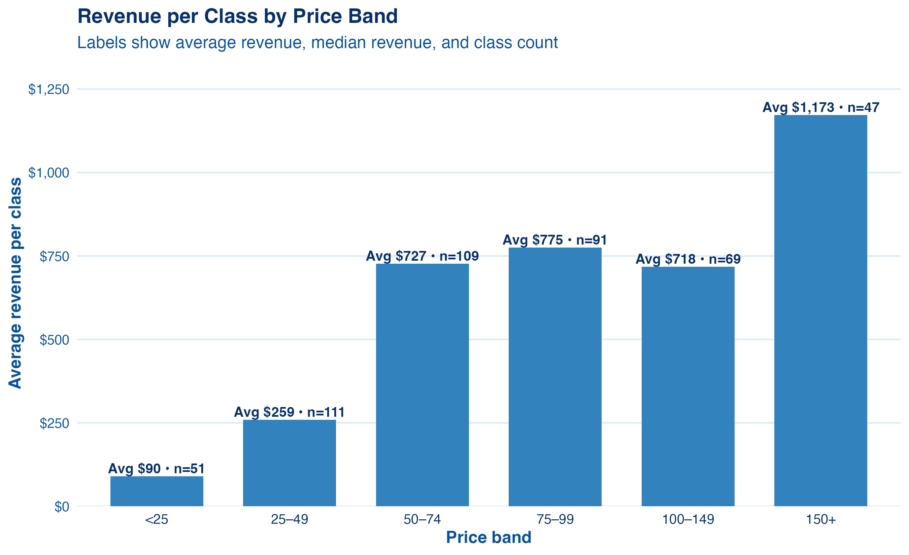

***
Script link: https://github.com/ash-datapro/allerton-project/blob/main/analysis1/price-points/class_price_fill_rate.R

<!-- > Insert Figure 27 here: Class Price vs Fill Rate -->

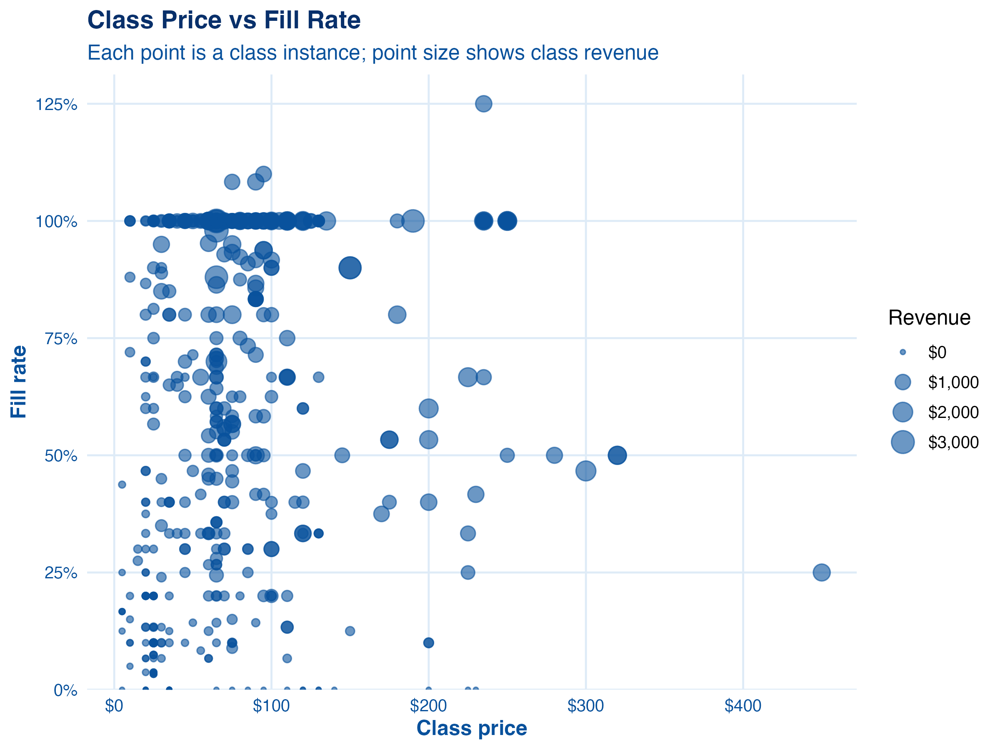

Interpretation. Average revenue per class rises sharply with higher price bands, reaching its highest level in the \$150+ range. However, the scatterplot shows substantial variability in fill rate at almost every price point. This suggests that price alone does not determine success; instead, class type, audience, and capacity likely interact with price.

### Heterogeneity by subcategory

Script link: https://github.com/ash-datapro/allerton-project/blob/main/analysis1/price-points/price_vs_fill_rate_subcategory.R

<!-- > Insert Figure 28 here: Price vs Fill Rate by Subcategory -->

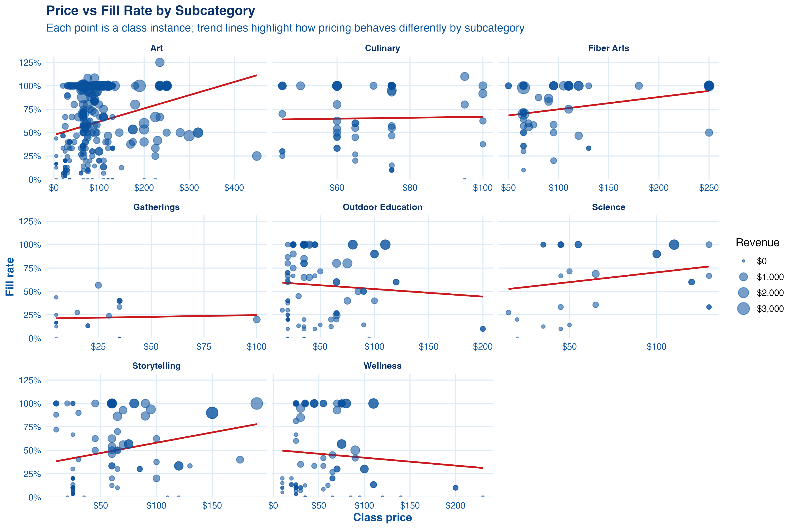

Interpretation. Pricing behavior is not uniform across the program. Some subcategories, including Art, Fiber Arts, Storytelling, and Science, appear to tolerate or even benefit from higher pricing, while Outdoor Education and Wellness show flatter or negative patterns. This supports a segmented pricing strategy rather than a single program-wide rule.

### Preliminary statistical direction

The final analysis should use formal models to evaluate whether observed price differences persist after accounting for other factors. Appropriate next steps include:

-   a beta regression or fractional logit model for fill rate,
-   a logistic regression for sellout probability,
-   and a linear or generalized linear model for class-level revenue.

These models should control for subcategory, capacity, season, platform, and possibly instructor or format variables if available.

# Discussion

## Synthesis across the three client questions

Several consistent patterns emerge across the analyses.

First, the nearby and regional audience is the program's foundation. Most attendees live within 30 miles of Allerton, and the local audience appears to spend slightly more and return more often.

Second, repeat attendees drive the business model. A little over half of attendees return, yet this group contributes about four-fifths of both registrations and revenue. This means that improving retention likely has a larger payoff than focusing only on one-time acquisition.

Third, middle price bands appear to be the strongest overall demand zone, while certain premium classes still perform well. The evidence so far does not support the idea that lower prices automatically improve outcomes.

Together, these findings suggest a feasible technical direction for the final report: integrate geography, retention, and pricing into an attendee- and class-level segmentation framework that can identify high-value audiences and high-performing class types.

## Limitations

The current report should be interpreted with the following limitations in mind:

-   attendee matching across platforms may still contain residual duplication or false merges,
-   ZIP-based distance is an approximation and may not perfectly represent actual travel burden,
-   some recent cohorts have less time to demonstrate repeat behavior,
-   class-level outcomes may be influenced by omitted factors such as instructor, marketing intensity, class capacity, and topic specificity,
-   and the current report emphasizes descriptive and preliminary inferential direction rather than fully adjusted final models.

These limitations do not invalidate the findings, but they do define the scope of inference at midterm.

# Conclusion

This midterm analysis provides a sound technical foundation for the remainder of the project. The combined registration data already support several client-relevant conclusions:

-   Allerton's market is concentrated in the nearby regional area.
-   Repeat attendees are the primary drivers of both registrations and revenue.
-   Pricing appears to have a segmented, non-linear relationship with demand, with particularly strong performance in the \$50-99 range and viable premium pricing for selected offerings.

These findings are directly aligned with the client's scope of work and establish a defensible basis for deeper modeling in the second half of the semester.

# Next steps

The following steps are recommended between midterm and the final report:

1.  Finalize the integrated master dataset by improving entity resolution across platforms and documenting any remaining missingness.
2.  Refocus the analysis on Folk School participants, since the final deliverable places special emphasis on that subset.
3.  Estimate formal statistical models for repeat attendance, spend, fill rate, and sellout probability.
4.  Test segmentation hypotheses combining geography, first subcategory, and price sensitivity.
5.  Develop client-ready decision tools, such as a short list of recommended target ZIPs, entry categories with strongest retention potential, and price bands appropriate for different subcategories.
6.  Produce polished reusable visuals and tables for the final presentation and final written report.

# Reproducibility appendix

Link to the full repository: https://github.com/ash-datapro/allerton-project
